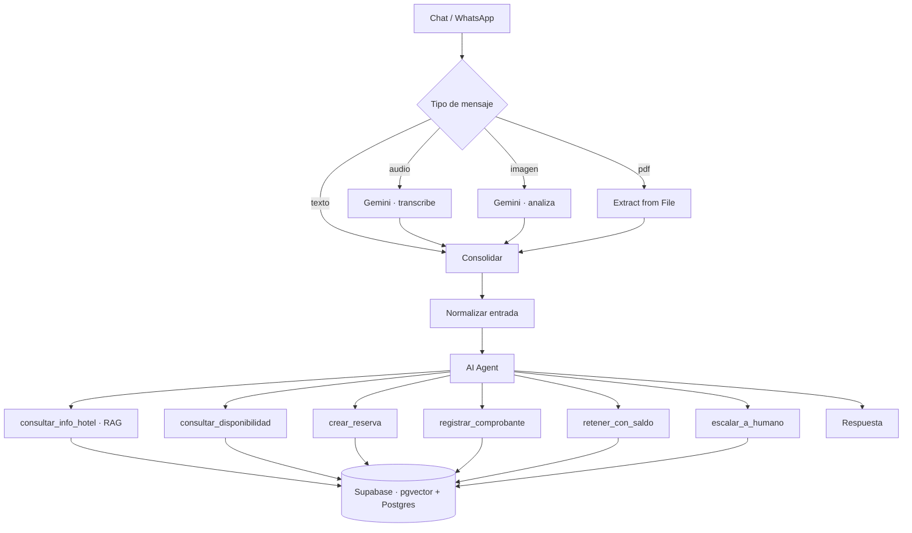

[English](README.md) · [Português](README.pt-BR.md) · **Español**

# Agente de Reservas Hoteleras con IA

Un agente de WhatsApp/chat que responde consultas, verifica disponibilidad **real**, toma reservas y procesa comprobantes de pago — para hoteles independientes.

Construido sobre n8n, Supabase y Google Gemini. La lógica de negocio vive en la base de datos, no en el prompt.


**[▶ Demo completa — 4 min](https://youtu.be/eq6xmbjIrdc)** · Español rioplatense

> El hotel de este repositorio es ficticio. Tarifas, datos bancarios e inventario son datos de demostración.

---

## El problema

Un hotel chico en una ciudad turística pierde reservas por tiempo de respuesta. Las consultas llegan a las 11 de la noche, un domingo, en pleno check-in. El dueño contesta cuando puede — y para entonces el huésped ya reservó en otro lado.

La solución obvia es un chatbot. El chatbot obvio es peor que nada: inventa precios, promete habitaciones ya ocupadas y confirma pagos que nadie verificó. Una reserva mal tomada cuesta más que todas las consultas que atendió.

Así que el problema real no es *responder*. Es responder **sin equivocarse nunca sobre inventario ni sobre plata**.

---

## La idea central

La mayoría de los agentes LLM meten las reglas de negocio dentro del prompt y después necesitan un modelo caro para que esas reglas se sostengan. Acá es al revés.

| Decisión | Quién la toma |
|---|---|
| ¿Hay habitación disponible en estas fechas? | SQL — solapamiento de fechas |
| ¿Cuánto cuesta la estadía? | SQL — nunca el modelo |
| ¿La reserva se toma de forma atómica? | SQL — `FOR UPDATE` en un solo bloque |
| ¿El saldo ya reportado cubre esta seña? | SQL — suma sobre la tabla de pagos |
| ¿Qué quiso decir el huésped y qué herramienta corresponde? | El modelo |

El modelo nunca calcula, nunca decide disponibilidad, nunca confirma plata. Enruta.

Tres consecuencias:

**Corre en un modelo barato.** La conversación completa de abajo — reserva, tres comprobantes, saldo aplicado — corrió en `gemini-3.5-flash-lite`, el modelo más económico de la línea.

**No depende del proveedor.** Cambiar Gemini por Claude o GPT es cambiar un nodo. La lógica de negocio no se mueve.

**Falla del lado seguro.** Un modelo chico no puede cotizar mal si nunca cotiza.

---

## Arquitectura



**Todo se convierte a texto antes de llegar al agente.** Audio, imágenes y PDF se procesan aguas arriba y llegan como una string etiquetada. El agente nunca sabe por qué canal entró el mensaje — por eso pasar de chat web a WhatsApp es editar un nodo, no rehacer el flujo.

**El conocimiento vive en el RAG, no en el prompt.** Tarifas, políticas, comodidades y datos bancarios están indexados vectorialmente en Supabase. Eso es lo que hace al sistema multi-tenant: un segundo hotel es una segunda base de conocimiento, no una segunda instalación.

---

## Decisiones de diseño

### La disponibilidad se calcula, no se cuenta

No hay columna `habitaciones_libres` que se desincronice. Cada consulta recalcula sobre las reservas que se solapan:

```sql
p_entrada < r.fecha_salida AND p_salida > r.fecha_entrada
```

`<` y `>` estrictos a propósito: quien sale el 15 no bloquea a quien entra el 15. Check-out 10:00, check-in 14:00.

### Las reservas son atómicas

Verificación de disponibilidad e inserción ocurren en un solo bloque, con `FOR UPDATE` sobre el tipo de habitación. Dos huéspedes reservando la última suite en el mismo segundo no pueden ganar los dos.

### El agente nunca confirma un pago

Es la regla de la que cuelga todo el diseño de pagos.

El agente recibe el comprobante, verifica cuenta de destino, monto y fecha, y **retiene** la habitación — nunca la marca como pagada. La verificación es humana, o por webhook de pasarela.

| Estado | Ocupa inventario | Expira solo |
|---|---|---|
| `hold_sin_comprobante` | sí | sí — 5 minutos |
| `hold_comprobante` | sí | **no** — espera verificación humana |
| `confirmada` | sí | no |
| `cancelada` / `expirada` / `no_show` | no | — |

Un LLM leyendo un comprobante es una superficie de fraude. El sistema extrae y señala; no libera inventario por criterio del modelo.

### Los comprobantes no se pueden reutilizar

Índice único parcial sobre el número de operación, más un manejo de excepción que corre **antes** de retener la habitación. El orden importa: PL/pgSQL solo revierte lo que está dentro del bloque de excepción, así que si la retención fuera primero, un comprobante reutilizado bloquearía una habitación antes de que salte la restricción.

Los comprobantes sin número de operación legible se rechazan: sin ese dato no hay contra qué deduplicar.

### El excedente lo aplica la base, no se discute en el chat

Si el huésped ya transfirió más de lo que exige la seña de una reserva, exigirle otra transferencia para la segunda pierde la venta por una formalidad.

Pero la cuenta no puede hacerla el modelo. `retener_con_saldo` calcula, acotado a la sesión de la conversación:

```
saldo = total reportado en esta sesión
      − señas ya comprometidas en esta sesión
```

Si alcanza, la habitación queda retenida y marcada en `notas`, para que quien verifique sepa que se cubrió con excedente y no con transferencia propia. El modelo llama la herramienta; la base hace la cuenta.

### Seguridad

RLS activo en todas las tablas con **cero policies**. Con RLS encendido y sin policies, `anon` y `authenticated` no tienen ningún acceso, aunque tengan GRANT a nivel de tabla — solo `service_role`, que bypassa RLS, puede operar. El workflow usa exclusivamente esa credencial.

Un event trigger fuerza RLS sobre cualquier tabla creada después, para que el modelo de seguridad no dependa de acordarse.

---

## Medido

Una conversación completa — consulta, disponibilidad, reserva de dos suites, tres comprobantes (menor, correcto, cuenta equivocada), manejo de agotamiento con alternativa, y excedente aplicado a una segunda reserva:

| | |
|---|---|
| Ejecuciones de n8n | 7 |
| Tokens de entrada | 92.760 |
| Tokens de salida | 1.770 |
| Modelo | `gemini-3.5-flash-lite` |
| Respuesta más lenta | 6,5 s |
| **Costo de API** | **US$ 0,032** |

Los tokens son las cifras facturadas por Google AI Studio, no estimaciones del framework.

La salida es el 1,9% del total. Casi todo el costo es el system prompt reenviado en cada llamada a herramienta — la palanca de costo es el tamaño del prompt, no el largo de las respuestas.

A unos tres centavos de dólar por conversación completa de reserva, 500 conversaciones al mes cuestan cerca de US$ 16 en llamadas al modelo. La orquestación y la base de datos cuestan más que el modelo.

---

## Repositorio

```
sql/
  01_schema.sql              tablas, índices, RLS, grants
  02_functions.sql           disponibilidad, reserva, comprobantes, confirmación
  04_retener_con_saldo.sql   aplicación de excedente
  03_seed_demo.sql           inventario del hotel de demo
workflows/
  agente_hotel_v8.json       agente principal
  ingestao_rag.json          ingesta de la base de conocimiento
prompts/
  system_prompt_agente.md    system prompt del agente
```

### Puesta en marcha

1. Correr el SQL en orden: `01` → `02` → `04` → `03`
2. Importar los dos workflows en n8n
3. Crear credenciales: Supabase (service_role) y Google Gemini
4. Reemplazar `REPLACE_PROJECT_REF` en los tres nodos HTTP
5. Correr la ingesta una vez — verificar con `select count(*) from documents_hotel;`
6. Publicar el workflow del agente

La columna de embedding es `vector(3072)`. Si cambiás de modelo de embedding y las dimensiones no coinciden, la inserción falla sin error obvio.

---

## Limitaciones conocidas

Dichas en claro, porque una demo que las esconde no vale mucho:

- **Sin webhook de pasarela de pago.** La confirmación es manual. Mercado Pago con `external_reference` es el camino previsto.
- **El agente no se apaga al escalar.** Sigue respondiendo por encima del operador humano. Falta un flag por sesión.
- **Las escalaciones no notifican a nadie.** Quedan en una tabla que todavía nadie mira.
- **Los holds vencidos no se limpian por schedule.** La función existe; nada la llama periódicamente.
- **Varias transferencias parciales distintas no se acumulan** contra una misma seña.
- **El alcance de sesión es más débil en chat web** que en WhatsApp, donde es el número de teléfono.
- **El canal WhatsApp está parked** en un workflow aparte, pendiente de acceso a la cuenta.

---

## Sobre el autor

**Rodrigo Teixeira Ferreira** — desarrollador de automatizaciones y agentes de IA, radicado en Villa Carlos Paz, Argentina.

[LinkedIn](https://www.linkedin.com/in/rodrigo-teixeira-ferreira-2b00a31b6)
