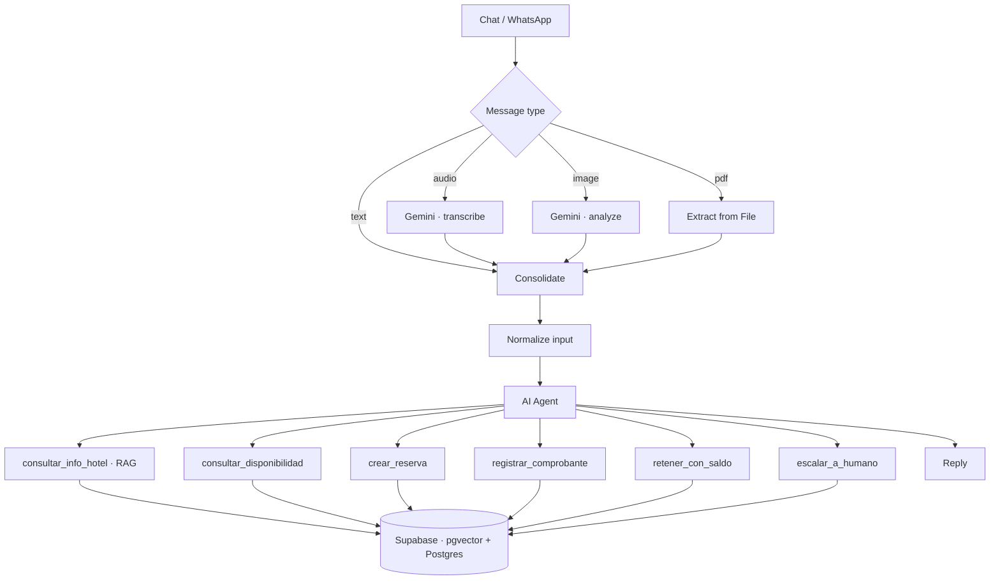

**English** · [Português](README.pt-BR.md) · [Español](README.es.md)

# Hotel AI Booking Agent

A WhatsApp/chat agent that answers guest questions, checks **real** room availability, takes reservations and processes payment receipts — for small independent hotels.

Built on n8n, Supabase and Google Gemini. The business logic lives in the database, not in the prompt.


**[▶ Full demo — 4 min](https://youtu.be/eq6xmbjIrdc)** · Spanish (Rioplatense)

> The hotel in this repository is fictional. Rates, bank details and inventory are demonstration data.

---

## The problem

A small hotel in a tourist town loses bookings to response time. Enquiries arrive at 11pm, on Sundays, during check-in rush. The owner answers when they can — and by then the guest has booked elsewhere.

The obvious fix is a chatbot. The obvious chatbot is worse than nothing: it quotes prices it invented, promises rooms that are already taken, and confirms payments nobody verified. One bad booking costs more than every enquiry it handled.

So the real problem isn't *answering*. It's answering **without ever being wrong about inventory or money**.

---

## The core idea

Most LLM agents put the business rules inside the prompt and then need an expensive model to hold them together. This one does the opposite.

| Decision | Who makes it |
|---|---|
| Is this room available on these dates? | SQL — date-overlap query |
| What does the stay cost? | SQL — never the model |
| Is the reservation confirmed atomically? | SQL — `FOR UPDATE` in a single block |
| Does the already-reported balance cover this deposit? | SQL — sum over the payments table |
| What did the guest actually mean, and which tool should run? | The model |

The model never calculates, never decides availability, never confirms money. It routes.

Three consequences:

**It runs on a cheap model.** The full conversation below — booking, three receipts, balance applied — ran on `gemini-3.5-flash-lite`, the cheapest model in the line.

**It isn't tied to a vendor.** Swapping Gemini for Claude or GPT is changing one node. The business logic doesn't move.

**It fails safe.** A small model cannot quote the wrong price if it never quotes prices.

---

## Architecture



**Media becomes text before the agent sees it.** Audio, images and PDFs are converted upstream and arrive as a tagged string. The agent never knows which channel a message came from — which is why moving from web chat to WhatsApp means editing one node, not rewriting the flow.

**Knowledge lives in RAG, not in the prompt.** Rates, policies, amenities and bank details are vector-indexed in Supabase. That's what makes the system multi-tenant: a second hotel is a second knowledge base, not a second deployment.

---

## Design decisions worth explaining

### Availability is computed, never counted

No `rooms_available` column to drift out of sync. Every query recalculates from overlapping reservations:

```sql
p_entrada < r.fecha_salida AND p_salida > r.fecha_entrada
```

Strict `<` and `>` on purpose: a guest checking out on the 15th does not block a guest checking in on the 15th. Check-out is 10am, check-in is 2pm.

### Reservations are atomic

Availability check and insert happen in one block, with `FOR UPDATE` on the room-type row. Two guests booking the last suite at the same second cannot both succeed.

### The agent never confirms a payment

This is the rule the whole payment design hangs from.

The agent receives a receipt, verifies destination account, amount and date, and **holds** the room — it never marks it paid. Verification is human, or a payment-gateway webhook.

Reservation states:

| State | Occupies inventory | Expires on its own |
|---|---|---|
| `hold_sin_comprobante` | yes | yes — 5 minutes |
| `hold_comprobante` | yes | **no** — waiting on human verification |
| `confirmada` | yes | no |
| `cancelada` / `expirada` / `no_show` | no | — |

An LLM reading a payment receipt is a fraud surface. The system extracts and flags; it does not release inventory on the model's judgement.

### Receipts can't be reused

A partial unique index on the operation number, plus an exception handler that runs **before** the room is held:

```sql
-- insert into pagos first; if the operation number already exists on another
-- reservation, unique_violation fires and we return without holding the room
```

Order matters. PL/pgSQL only rolls back what's inside the exception block — had the hold come first, a reused receipt would have locked a room before the constraint fired.

Receipts arriving without a readable operation number are rejected outright: without it there is nothing to deduplicate against.

### Surplus is applied by the database, not argued in chat

If a guest has already transferred more than one reservation's deposit requires, demanding another transfer for the second booking loses the sale over a formality.

But the arithmetic cannot be the model's. `retener_con_saldo` computes, scoped to the conversation session:

```
balance = total reported in this session
        − deposits already committed in this session
```

If the balance covers the new deposit, the room is held and flagged in `notas` so whoever verifies knows it was covered by surplus rather than its own transfer. The model calls the tool; the database does the maths.

### Security

Row Level Security is enabled on every table with **zero policies**. With RLS on and no policies, `anon` and `authenticated` have no access at all, regardless of table grants — only `service_role`, which bypasses RLS, can operate. The n8n workflow uses `service_role` exclusively.

An event trigger enforces RLS on any table created later, so the model doesn't depend on remembering.

---

## Measured

One complete conversation — enquiry, availability, two-suite booking, three receipts (short, correct, wrong account), sold-out handling with alternative offered, and surplus applied to a second reservation:

| | |
|---|---|
| n8n executions | 7 |
| Input tokens | 92,760 |
| Output tokens | 1,770 |
| Model | `gemini-3.5-flash-lite` |
| Slowest response | 6.5 s |
| **API cost** | **US$ 0.032** |

Token counts are the billed figures from Google AI Studio, not framework estimates.

Output is 1.9% of the total. Almost all cost is the system prompt being resent on each tool call — so the cost lever is prompt size, not response length.

At roughly three US cents per full booking conversation, 500 conversations a month cost about US$ 16 in model calls. Orchestration and database cost more than the model does.

---

## Repository

```
sql/
  01_schema.sql              tables, indexes, RLS, grants
  02_functions.sql           availability, booking, receipts, confirmation
  04_retener_con_saldo.sql   surplus application
  03_seed_demo.sql           demo hotel inventory
workflows/
  agente_hotel_v8.json       main agent
  ingestao_rag.json          knowledge-base ingestion
prompts/
  system_prompt_agente.md    the agent's system prompt
```

### Running it

1. Run the SQL in order: `01` → `02` → `04` → `03`
2. Import both workflows into n8n
3. Create credentials: Supabase (service_role) and Google Gemini
4. Replace `REPLACE_PROJECT_REF` in the three HTTP tool nodes
5. Run the ingestion workflow once — verify with `select count(*) from documents_hotel;`
6. Publish the agent workflow

The embedding column is `vector(3072)`. If you swap embedding models and dimensions don't match, inserts fail without an obvious error.

---

## Known limitations

Stated plainly, because a demo that hides them isn't worth much:

- **No payment-gateway webhook.** Confirmation is manual. Mercado Pago with `external_reference` is the intended path.
- **The agent doesn't stand down after escalating.** It will keep replying over a human operator. Needs a per-session flag.
- **Escalations aren't pushed anywhere.** They land in a table nobody watches yet.
- **Expired holds aren't swept on a schedule.** The function exists; nothing calls it periodically.
- **Multiple separate partial transfers aren't accumulated** against a single deposit.
- **Session scope is weaker on web chat** than on WhatsApp, where it's the phone number.
- **WhatsApp channel is parked** in a separate workflow pending account access.

---

## About

Built by **Rodrigo Teixeira Ferreira** — automation and AI agent developer, based in Villa Carlos Paz, Argentina.

[LinkedIn](https://www.linkedin.com/in/rodrigo-teixeira-ferreira-2b00a31b6)
