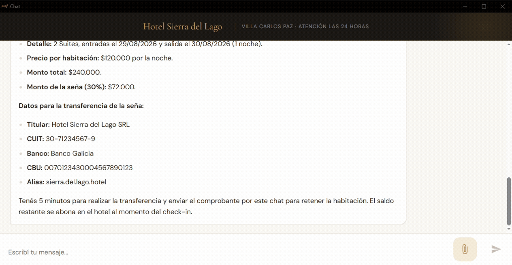
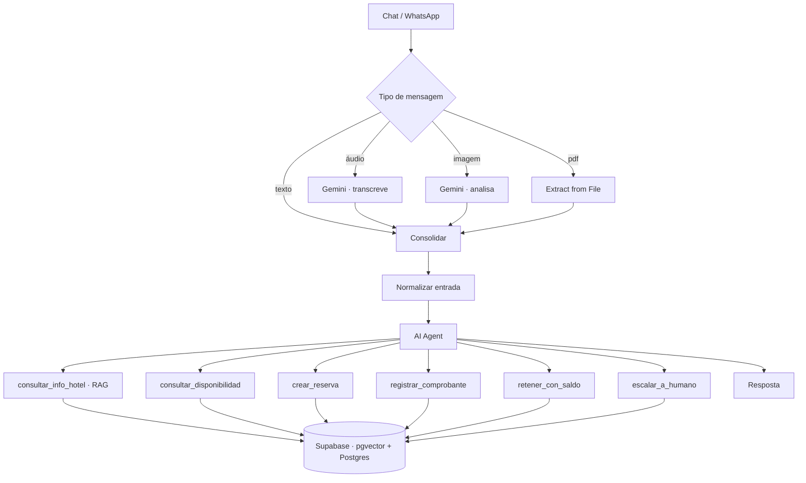

[English](README.md) · **Português** · [Español](README.es.md)

# Agente de Reservas Hoteleiras com IA

Um agente de WhatsApp/chat que responde dúvidas, verifica disponibilidade **real**, toma reservas e processa comprovantes de pagamento — para hotéis independentes.

Construído sobre n8n, Supabase e Google Gemini. A lógica de negócio mora no banco de dados, não no prompt.



**[▶ Demonstração completa — 4 min](https://youtu.be/eq6xmbjIrdc)** · em espanhol rioplatense

> O hotel deste repositório é fictício. Tarifas, dados bancários e inventário são dados de demonstração.

---

## O problema

Um hotel pequeno numa cidade turística perde reserva por tempo de resposta. A consulta chega às 23h, num domingo, no meio do check-in. O dono responde quando dá — e a essa altura o hóspede já reservou em outro lugar.

A solução óbvia é um chatbot. O chatbot óbvio é pior que nada: inventa preço, promete quarto já ocupado e confirma pagamento que ninguém verificou. Uma reserva mal tomada custa mais do que todas as consultas que ele atendeu.

Ou seja, o problema real não é *responder*. É responder **sem nunca errar sobre inventário nem sobre dinheiro**.

---

## A ideia central

A maioria dos agentes de LLM coloca as regras de negócio dentro do prompt e depois precisa de um modelo caro para que essas regras se sustentem. Aqui é o contrário.

| Decisão | Quem toma |
|---|---|
| Tem quarto disponível nessas datas? | SQL — sobreposição de datas |
| Quanto custa a estadia? | SQL — nunca o modelo |
| A reserva é criada de forma atômica? | SQL — `FOR UPDATE` num bloco só |
| O saldo já reportado cobre esta seña? | SQL — soma sobre a tabela de pagamentos |
| O que o hóspede quis dizer e qual ferramenta chamar? | O modelo |

O modelo nunca calcula, nunca decide disponibilidade, nunca confirma dinheiro. Ele roteia.

Três consequências:

**Roda em modelo barato.** A conversa completa descrita abaixo — reserva, três comprovantes, saldo aplicado — rodou em `gemini-3.5-flash-lite`, o modelo mais econômico da linha.

**Não depende de fornecedor.** Trocar Gemini por Claude ou GPT é trocar um node. A lógica de negócio não se move.

**Falha para o lado seguro.** Um modelo pequeno não tem como cotar errado se ele nunca cota.

---

## Arquitetura



**Toda mídia vira texto antes de chegar ao agente.** Áudio, imagem e PDF são convertidos antes e chegam como uma string com etiqueta. O agente nunca sabe por qual canal a mensagem entrou — por isso migrar de chat web para WhatsApp é editar um node, não refazer o fluxo.

**O conhecimento mora no RAG, não no prompt.** Tarifas, políticas, comodidades e dados bancários estão indexados vetorialmente no Supabase. É isso que torna o sistema multi-tenant: um segundo hotel é uma segunda base de conhecimento, não uma segunda instalação.

---

## Decisões de projeto

### Disponibilidade é calculada, nunca contada

Não existe coluna `quartos_livres` para dessincronizar. Cada consulta recalcula a partir das reservas que se sobrepõem:

```sql
p_entrada < r.fecha_salida AND p_salida > r.fecha_entrada
```

`<` e `>` estritos de propósito: quem sai no dia 15 não bloqueia quem entra no dia 15. Check-out às 10h, check-in às 14h.

### Reservas são atômicas

Verificação de disponibilidade e inserção acontecem no mesmo bloco, com `FOR UPDATE` sobre o tipo de quarto. Dois hóspedes reservando a última suíte no mesmo segundo não podem ganhar os dois.

### O agente nunca confirma um pagamento

É a regra da qual todo o desenho de pagamento depende.

O agente recebe o comprovante, verifica conta de destino, valor e data, e **retém** o quarto — nunca marca como pago. A verificação é humana, ou por webhook de gateway.

| Estado | Ocupa inventário | Expira sozinho |
|---|---|---|
| `hold_sin_comprobante` | sim | sim — 5 minutos |
| `hold_comprobante` | sim | **não** — aguarda verificação humana |
| `confirmada` | sim | não |
| `cancelada` / `expirada` / `no_show` | não | — |

Um LLM lendo comprovante é superfície de fraude. O sistema extrai e sinaliza; não libera inventário por critério do modelo.

### Comprovante não pode ser reaproveitado

Índice único parcial sobre o número da operação, mais um tratamento de exceção que roda **antes** de reter o quarto. A ordem importa: PL/pgSQL só desfaz o que está dentro do bloco de exceção, então se a retenção viesse primeiro, um comprovante reutilizado travaria um quarto antes de a restrição disparar.

Comprovante sem número de operação legível é recusado: sem esse dado não há contra o que deduplicar.

### O excedente é aplicado pelo banco, não discutido no chat

Se o hóspede já transferiu mais do que a seña de uma reserva exige, cobrar outra transferência pela segunda reserva perde a venda por formalidade.

Mas a conta não pode ser do modelo. `retener_con_saldo` calcula, restrito à sessão da conversa:

```
saldo = total reportado nesta sessão
      − señas já comprometidas nesta sessão
```

Se cobre, o quarto é retido e marcado em `notas`, para que quem verificar saiba que foi coberto por excedente e não por transferência própria. O modelo chama a ferramenta; o banco faz a conta.

### Segurança

RLS ativo em todas as tabelas com **zero policies**. Com RLS ligado e nenhuma policy, `anon` e `authenticated` ficam sem acesso algum, mesmo tendo GRANT no nível da tabela — só `service_role`, que ignora RLS por definição, consegue operar. O workflow usa exclusivamente essa credencial.

Um event trigger força RLS em qualquer tabela criada depois, para o modelo de segurança não depender de alguém lembrar.

---

## Medido

Uma conversa completa — consulta, disponibilidade, reserva de duas suítes, três comprovantes (valor menor, correto, conta errada), esgotamento com alternativa oferecida, e excedente aplicado a uma segunda reserva:

| | |
|---|---|
| Execuções de n8n | 7 |
| Tokens de entrada | 92.760 |
| Tokens de saída | 1.770 |
| Modelo | `gemini-3.5-flash-lite` |
| Resposta mais lenta | 6,5 s |
| **Custo de API** | **US$ 0,032** |

Os tokens são os valores faturados pelo Google AI Studio, não estimativas do framework.

A saída é 1,9% do total. Quase todo o custo é o system prompt sendo reenviado a cada chamada de ferramenta — ou seja, a alavanca de custo é o tamanho do prompt, não o tamanho da resposta.

A cerca de três centavos de dólar por conversa completa de reserva, 500 conversas por mês custam algo como US$ 16 em chamadas ao modelo. Orquestração e banco de dados custam mais do que o modelo.

---

## Repositório

```
sql/
  01_schema.sql              tabelas, índices, RLS, grants
  02_functions.sql           disponibilidade, reserva, comprovantes, confirmação
  04_retener_con_saldo.sql   aplicação de excedente
  03_seed_demo.sql           inventário do hotel de demonstração
workflows/
  agente_hotel_v8.json       agente principal
  ingestao_rag.json          ingestão da base de conhecimento
prompts/
  system_prompt_agente.md    system prompt do agente
```

### Como rodar

1. Rodar o SQL na ordem: `01` → `02` → `04` → `03`
2. Importar os dois workflows no n8n
3. Criar as credenciais: Supabase (service_role) e Google Gemini
4. Substituir `REPLACE_PROJECT_REF` nos três nodes HTTP
5. Rodar a ingestão uma vez — validar com `select count(*) from documents_hotel;`
6. Publicar o workflow do agente

A coluna de embedding é `vector(3072)`. Se trocar de modelo de embedding e a dimensão não bater, o insert falha sem erro óbvio.

---

## Limitações conhecidas

Ditas com clareza, porque demonstração que esconde limitação não vale muito:

- **Sem webhook de gateway de pagamento.** A confirmação é manual. Mercado Pago com `external_reference` é o caminho previsto.
- **O agente não se desliga ao escalar.** Continua respondendo por cima do atendente humano. Falta uma flag por sessão.
- **Escalações não notificam ninguém.** Ficam numa tabela que ainda ninguém consulta.
- **Holds vencidos não são limpos por schedule.** A função existe; nada a chama periodicamente.
- **Várias transferências parciais distintas não são acumuladas** contra a mesma seña.
- **O escopo de sessão é mais fraco no chat web** do que no WhatsApp, onde é o número de telefone.
- **O canal WhatsApp está parado** num workflow separado, aguardando acesso à conta.

---

## Sobre

Feito por **Rodrigo Teixeira Ferreira** — desenvolvedor de automações e agentes de IA, radicado em Villa Carlos Paz, Argentina.

[LinkedIn](https://www.linkedin.com/in/rodrigo-teixeira-ferreira-2b00a31b6)
